1. **[Nigrostriatal](#nigrostriatal)**
2. **[Mesocorticolimbic](#mesocorticolimbic)**
3. **[Integration](#integration)**
4. **[Parts of dopamine pathway](#parts)**

## Nigrostriatal pathway

========================

## Mesocoricolimbic pathway

========================

## Integration

========================

## Parts 

### Motor cortex 
Sagittal | Coronal    | Horizontal
---------|------------|---------
 | 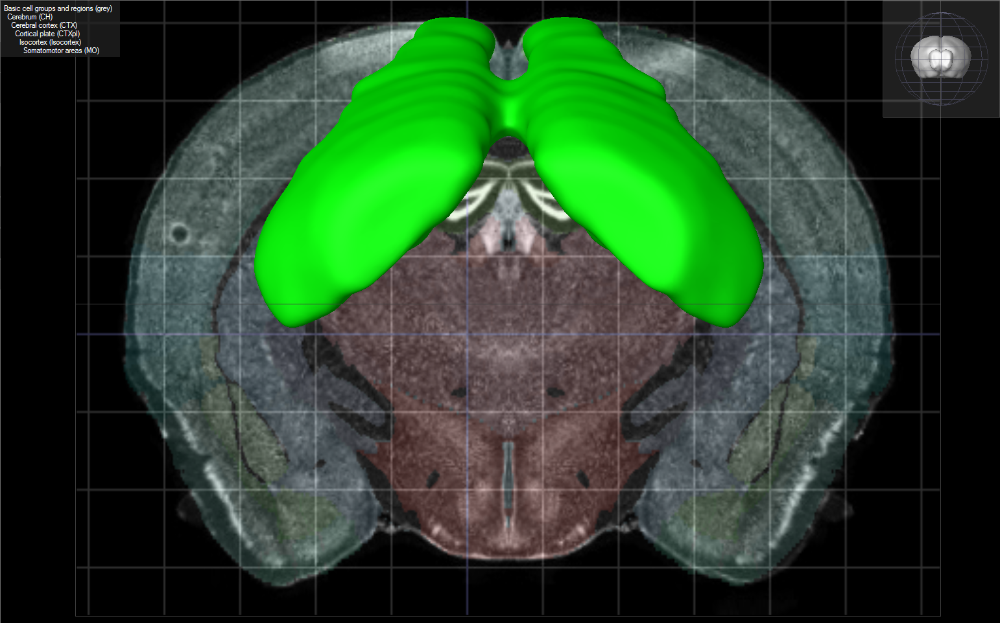 | 

### Striatum
> In all primates the [dorsal striatum](#dorsal-striatum) is divided by a white matter tract called the internal capsule into two sectors called the *caudate nucleus* and **the putamen**. The [ventral striatum](#ventral-striatum) is composed of the **nucleus accumbens** and olfactory tubercle in primates. Functionally, the striatum coordinates multiple aspects of cognition, including motor and action planning, decision-making, motivation, reinforcement, and reward perception.   

#### 1. Dorsal striatum
#### 1.1 Putamen

Sagittal | Coronal    | Horizontal
---------|------------|---------
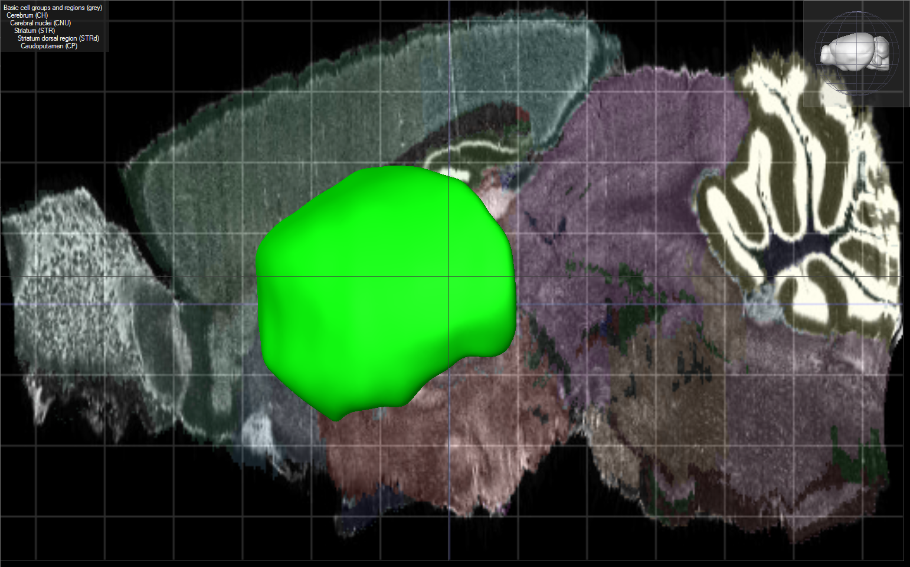 | 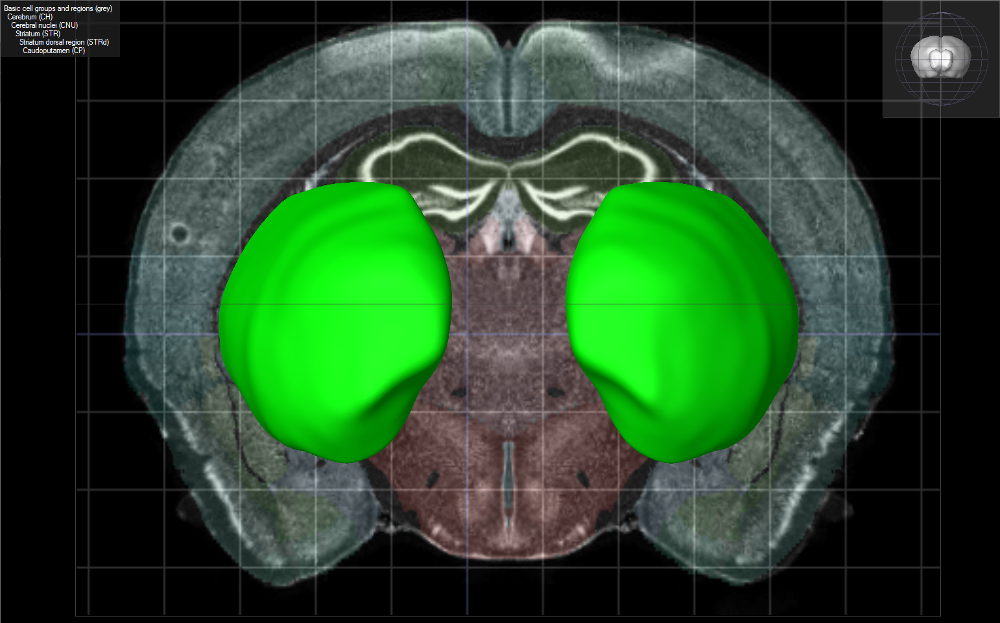 | 

#### 2.1 Ventral striatum

> The ventral striatum is the ventral part of the striatum, which is a major portion of the basal ganglia and functions as part of the reward system. It consists of the *nucleus accumbens* and *olfactory tubercle*. It is associated 	with the limbic system and has been implicated as a vital part of the circuitry for decision making and reward behaviors, including addiction. [Reference](https://en.wikipedia.org/wiki/Ventral_striatum)

#### NAcc (see in ...)

Sagittal | Coronal    | Horizontal
---------|------------|---------
 | 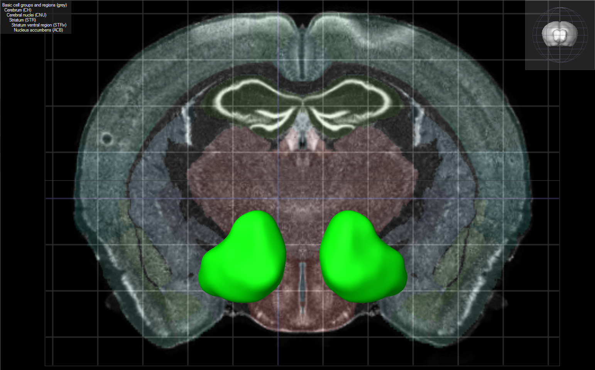 | 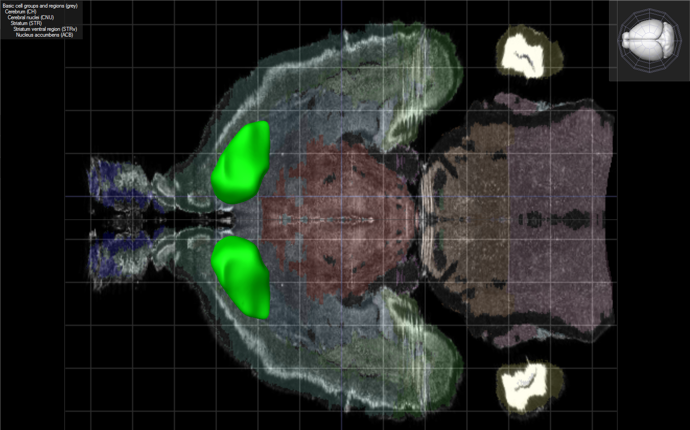

http://www.jneurosci.org/content/18/17/6650.full.pdf
"GABAergic medium spiny projection neurons constitute the vast majority (~95%) of neurons in the NAcc."

### Thalamus 

Sagittal | Coronal    | Horizontal
---------|------------|---------
 |  | 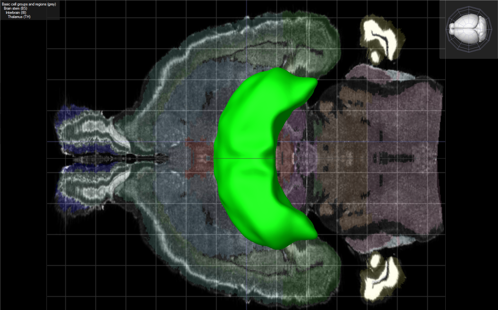

### STN

Sagittal | Coronal    | Horizontal
---------|------------|---------
 |  | 

### Substancia nigra

#### pars compacta

Sagittal | Coronal    | Horizontal
---------|------------|---------
 |  | 

#### pars reticulata

Sagittal | Coronal    | Horizontal
---------|------------|---------
 | 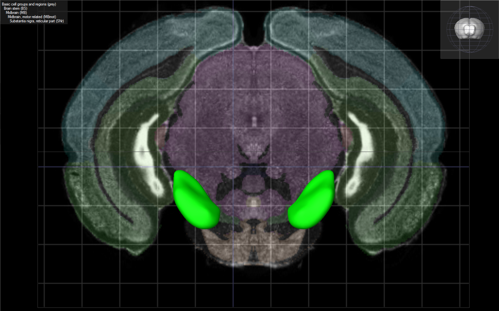 | 

### Globus  Pallidus

#### internal

Sagittal | Coronal    | Horizontal
---------|------------|---------
 |  | 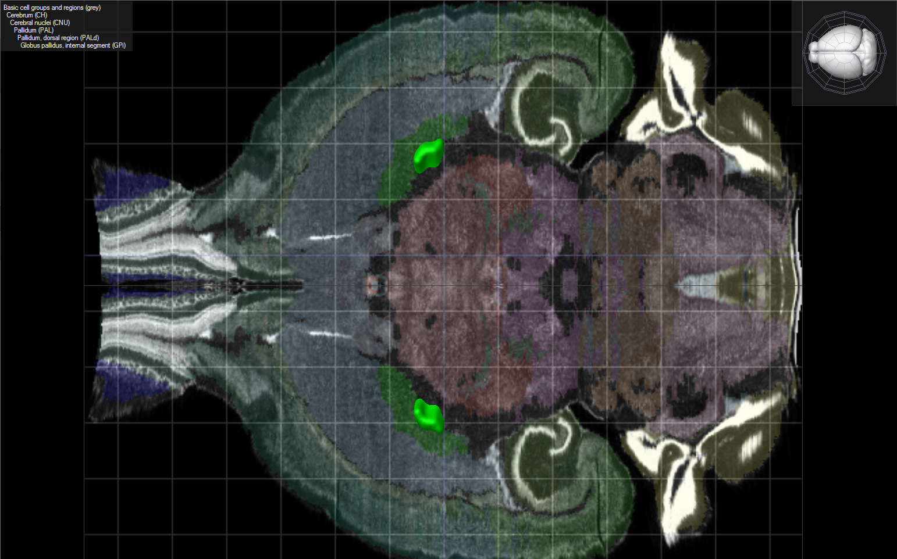

#### external

Sagittal | Coronal    | Horizontal
---------|------------|---------
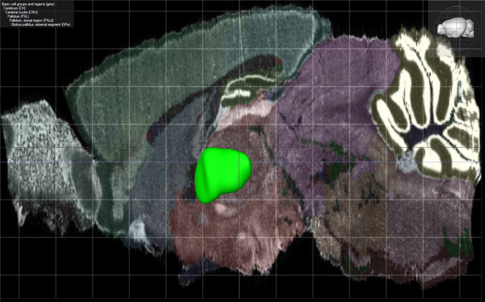 | 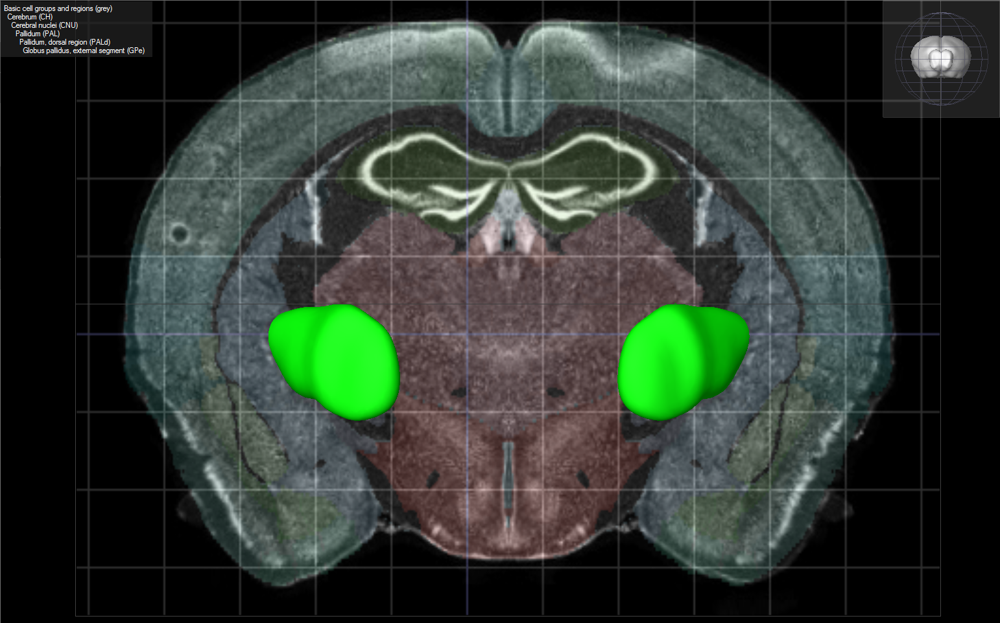 | 

### VTA

Sagittal | Coronal    | Horizontal
---------|------------|---------
 | 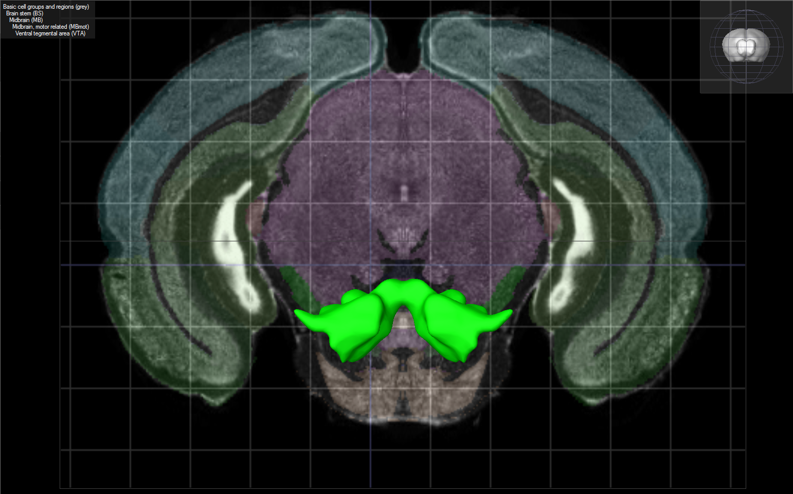 | 

### PPTg

Sagittal | Coronal    | Horizontal
---------|------------|---------
 |  | 

### Amygdala

Full table of neuron number

Part									|Neuron number   	| Link
----------------------------------------|-------------------|-----
**Motor cortex**						|					| [[1](#motor-cortex)]
motor cortex[Glu0]						|29000000 * 0.8 /6	| 
motor cortex[Glu1]						|29000000 * 0.2 /6	| 
**Striatum**							|					| [[2](#striatum)]
striatum[D1]							|2500000 * 0.425	| 
striatum[D2]							|2500000 * 0.425	| 
striatum[tan]							|2500000 * 0.05		| 
**Globus pallidus**						|					| [[3](#globus-pallidus)]
gpe[GABA]								|84100				| 
gpi[GABA]								|12600				|
**Subthalamic nucleus**					|					| [[4](#subthalamic-nucleus)]
stn[Glu]								|22700				
**Substancia nigra**					|					| [[5](#substancia-nigra)]
snc[GABA]								|3000
snc[DA]									|12700
snr[GABA]								|47200
**Thalamus**							|					| [[5](#thalamus)]
thalamus[Glu]							|5000000 / 6
**Prefrontal cortex**					|					| [[6](#prefrontal-cortex)]
prefrontal cortex[Glu0]					|183000
prefrontal cortex[Glu1]					|183000
**Nucleus Accumbens**					|					| [[7](#nucleus-accumbens)]
nac[ACh]								|1500
nac[GABA0]								|14250
nac[GABA1]								|14250
**Ventral tegemntal area**				|					|[[8](#vta)]
vta[GABA0]								|7000
vta[DA0]								|20000
vta[GABA1]								|7000
vta[DA1]								|20000
vta[GABA2]								|7000
**Pedunculopontine tegmental nucleus**	|					|[[9](#pptg)]
tpp[GABA]								|2000
tpp[ACh]								|1400
tpp[Glu]								|2300
**Amygdala**							|					|[[10](#amygdala)]
amygdala[Glu]							|30000