1. **[Nigrostriatal](#nigrostriatal-pathway)**
2. **[Mesocorticolimbic](#mesocorticolimbic-pathway)**
3. **[Integration](#integration)**
4. **[Parts of dopamine pathway](#parts)**

[Janhunen2006]: https://www.researchgate.net/publication/6656868_Janhunen_S_Ahtee_L_Differential_nicotinic_regulation_of_the_nigrostriatal_and_mesolimbic_dopaminergic_pathways_implications_for_drug_development_Neurosci_Biobehav_Rev_31_287-314
[Dongen2007]: http://dare.ubvu.vu.nl/bitstream/handle/1871/11031/6554.pdf
[Jennifer2014]: https://www.researchgate.net/publication/264427777_The_neurobiology_of_methamphetamine_induced_psychosis

### About dopamine

### Dopamine synapse and effects

**Advanced scheme**

========================

### Nigrostriatal pathway

<table>
	<tr align="center">
		<td width="33%">
			
		<td width="33%">
			
		<td width="33%">
			
	<tr align="center">
		<td>
			<b>
				<a href="https://github.com/research-team/NEUCOGAR/tree/master/nest/dopamine/nigrostriatal/step_1"> Step 1 </a>
		<td>
			<b>
				<a href="https://github.com/research-team/NEUCOGAR/tree/master/nest/dopamine/nigrostriatal/step_2"> Step 2 </a>
		<td>
			<b>
				<a href="https://github.com/research-team/NEUCOGAR/tree/master/nest/dopamine/nigrostriatal/step_3"> Step 3 </a>
	<tr align="center">
		<td colspan="3">
			
</table>

 Source    	| Destination 	| Connection        
-----------:|---------------|-------------------
			|				|
			|				|
			|				|
			|				|
			|				|
			|				|
			|				|
			|				|
			|				|
			|				|
			|				|
			|				|
			|				|
			|				|
			|				|
			|				|
			|				|
			|				|

========================

### Mesocorticolimbic pathway

<table>
	<tr align="center">
		<td>
			  
	<tr align="center">
		<td>
			<a href="https://www.researchgate.net/publication/6656868_Janhunen_S_Ahtee_L_Differential_nicotinic_regulation_of_the_nigrostriatal_and_mesolimbic_dopaminergic_pathways_implications_for_drug_development_Neurosci_Biobehav_Rev_31_287-314">Source</a>
			p291
	<tr>
		<td colspan="3" align="center">
			
</table>

| Source    | Destination | Connection        |
|----------:|-------------|-------------------|
|PFC[Glu1]  | NAc[GABA1]  | Glutamatergic     |
|PFC[Glu1]  | VTA[GABA2]  | Glutamatergic     |
|PFC[Glu0]  | VTA[DA0]    | Glutamatergic     |
|NAc[Ach]   | NAc[GABA1]  | Acetylcholinergic |
|NAc[GABA0] | NAc[GABA1]  | GABAergic         |
|NAc[GABA1] | VTA[GABA2]  | GABAergic         |
|VTA[GABA0] | PFC         | GABAergic         |
|VTA[GABA0] | TPP[GABA0]  | GABAergic         |
|VTA[DA0]   | PFC         | Dopaminergic      |
|VTA[GABA1] | VTA[DA0]    | GABAergic         |
|VTA[GABA1] | VTA[DA1]    | GABAergic         |
|VTA[DA1]   | NAc[GABA1]  | Dopaminergic      |
|VTA[GABA2] | NAc[GABA1]  | GABAergic         |
|TPP[GABA]  | VTA[GABA0]  | GABAergic         |
|TPP[Ach]   | VTA[GABA0]  | Acetylcholinergic |
|TPP[Ach]   | VTA[DA1]    | Acetylcholinergic |
|TPP[GLu]   | VTA[GABA0]  | Glutamatergic     |
|TPP[Glu]   | VTA[DA1]    | Glutamatergic     |

========================

### Integration

<table>
	<tr align="center">
		<td width="25%">
			
		<td width="25%">
			
		<td width="25%">
			 
		<td width="25%">
			
	<tr align="center">
		<td>
			<a href="#nigrostriatal-pathway">Nigrostriatal</a>
		<td>
			<a href="#mesocorticolimbic-pathway">Mesocorticolimbic</a>
		<td>
			<a href="http://dare.ubvu.vu.nl/bitstream/handle/1871/11031/6554.pdf">Source</a>
			p19
		<td>
			<a href="https://www.researchgate.net/publication/264427777_The_neurobiology_of_methamphetamine_induced_psychosis">Source</a>
			p3
	<tr align="center">
		<td colspan="4">
			
</table>

 Source    	| Destination 	| Connection        
-----------:|---------------|-------------------
			|				|
			|				|
			|				|
			|				|
			|				|
			|				|
			|				|
			|				|
			|				|
			|				|
			|				|
			|				|
			|				|
			|				|
			|				|
			|				|
			|				|
			|				|

========================

## Parts 

### Motor cortex 
Sagittal | Coronal    | Horizontal
---------|------------|---------
 |  | 

### Prefrontal cortex 

http://www.sciencedirect.com/science/article/pii/S0306452214007155

Sagittal | Coronal    | Horizontal
---------|------------|---------
		 |			  |

### Striatum
> In all primates the [dorsal striatum](#dorsal-striatum) is divided by a white matter tract called the internal capsule into two sectors called the *caudate nucleus* and **the putamen**. The [ventral striatum](#ventral-striatum) is composed of the **nucleus accumbens** and olfactory tubercle in primates. Functionally, the striatum coordinates multiple aspects of cognition, including motor and action planning, decision-making, motivation, reinforcement, and reward perception.   

#### 1. Dorsal striatum
#### 1.1 Putamen

Sagittal | Coronal    | Horizontal
---------|------------|---------
 |  | 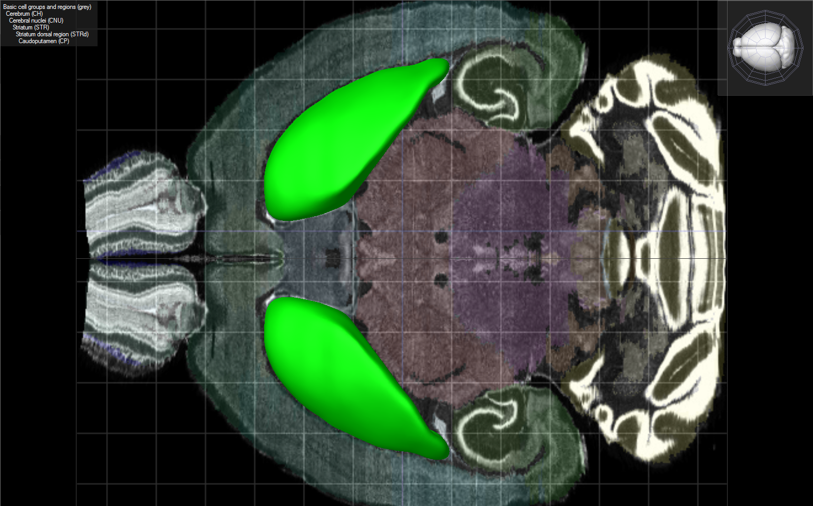

#### 2.1 Ventral striatum

> The ventral striatum is the ventral part of the striatum, which is a major portion of the basal ganglia and functions as part of the reward system. It consists of the *nucleus accumbens* and *olfactory tubercle*. It is associated 	with the limbic system and has been implicated as a vital part of the circuitry for decision making and reward behaviors, including addiction. [Reference](https://en.wikipedia.org/wiki/Ventral_striatum)

#### NAcc

Sagittal | Coronal    | Horizontal
---------|------------|---------
 |  | 

http://www.jneurosci.org/content/18/17/6650.full.pdf
"GABAergic medium spiny projection neurons constitute the vast majority (~95%) of neurons in the NAcc."

### Thalamus 

Sagittal | Coronal    | Horizontal
---------|------------|---------
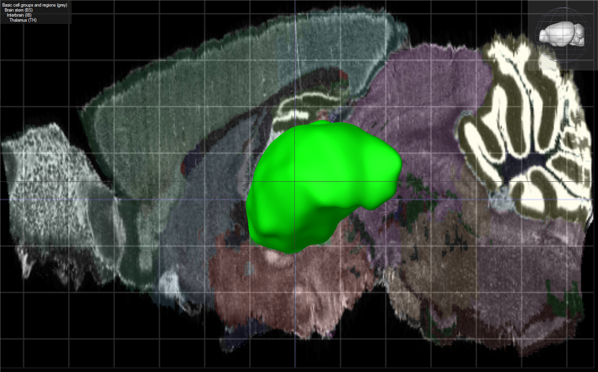 |  | 

### STN

Sagittal | Coronal    | Horizontal
---------|------------|---------
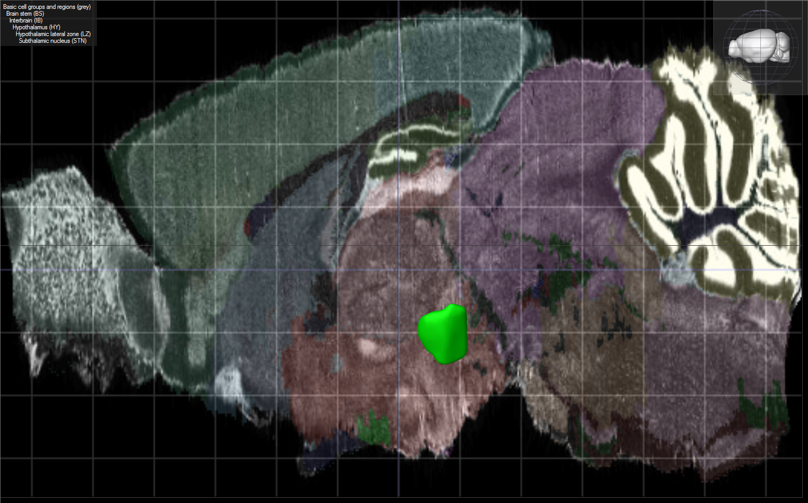 | 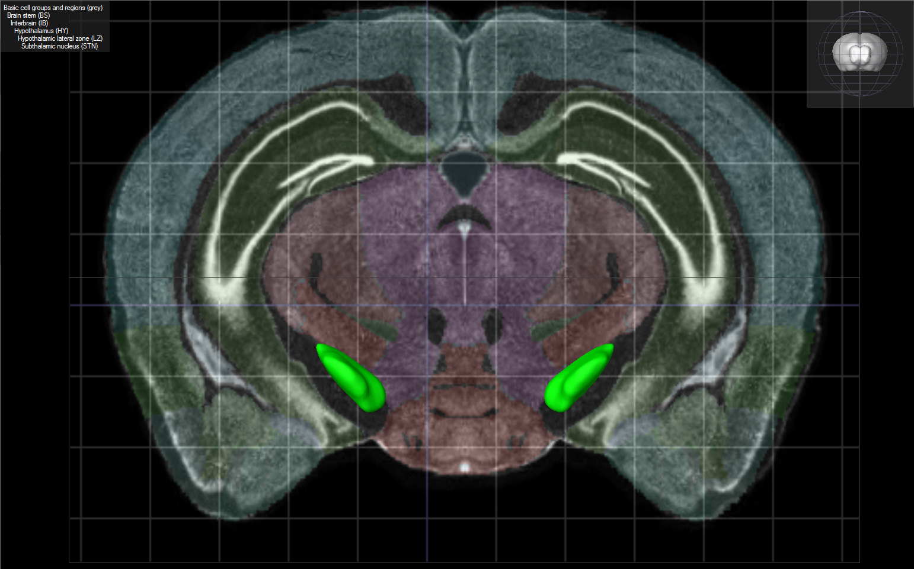 | 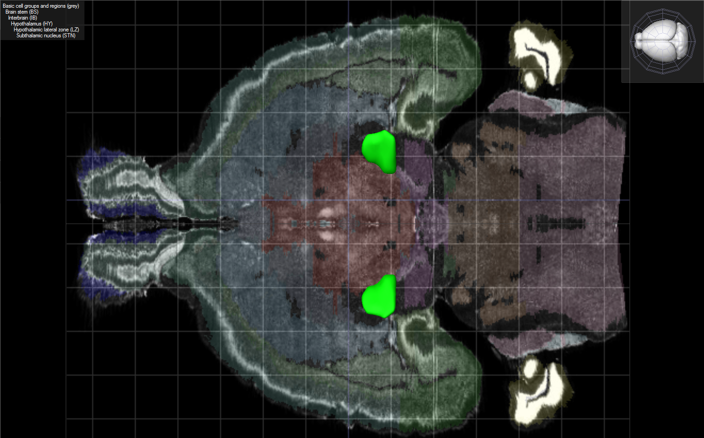

### Substancia nigra

#### pars compacta

Sagittal | Coronal    | Horizontal
---------|------------|---------
 |  | 

#### pars reticulata

Sagittal | Coronal    | Horizontal
---------|------------|---------
 |  | 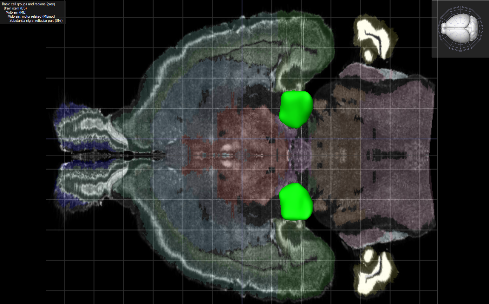

### Globus  Pallidus

#### internal

Sagittal | Coronal    | Horizontal
---------|------------|---------
 | 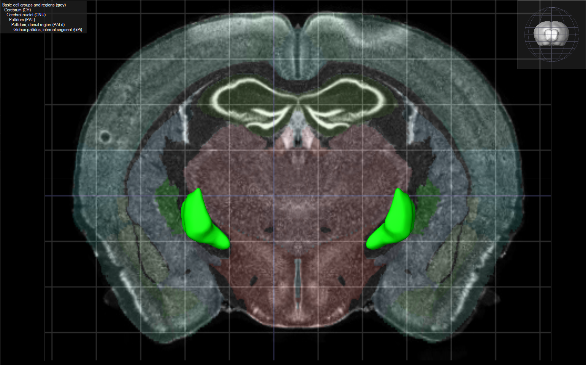 | 

#### external

Sagittal | Coronal    | Horizontal
---------|------------|---------
 |  | 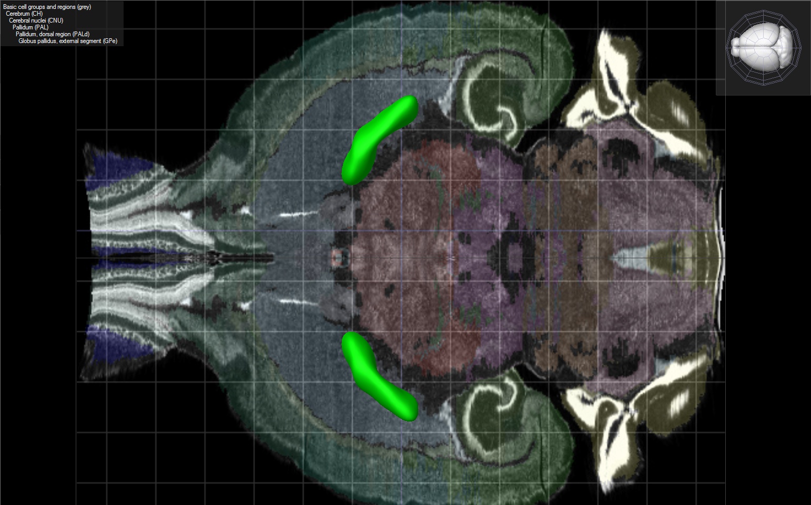

### VTA

Sagittal | Coronal    | Horizontal
---------|------------|---------
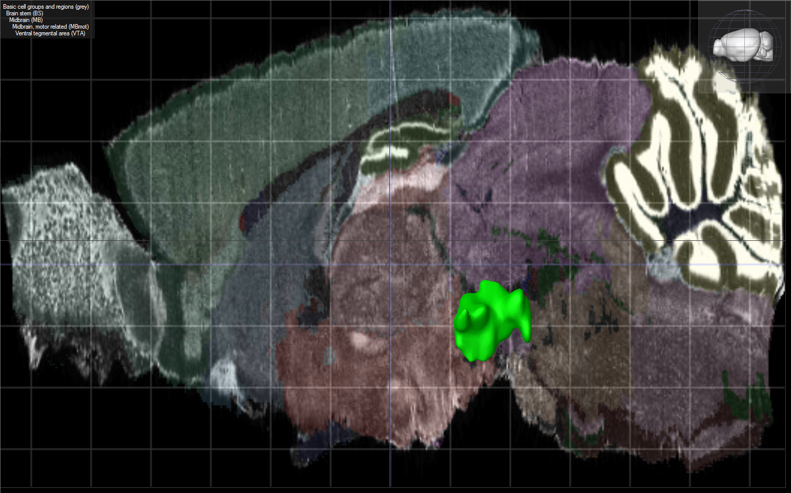 |  | 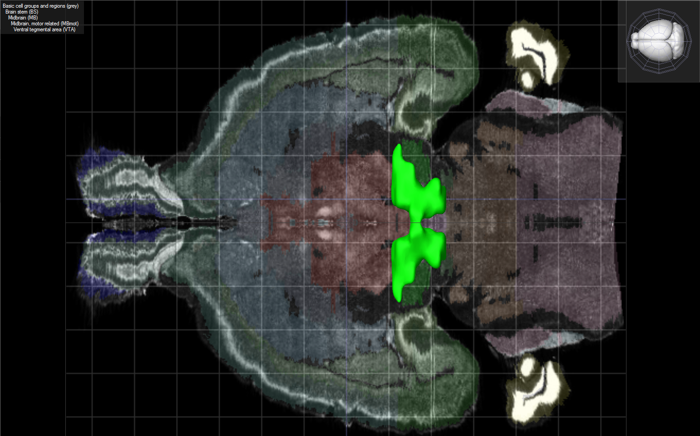

### PPTg

Sagittal | Coronal    | Horizontal
---------|------------|---------
 | 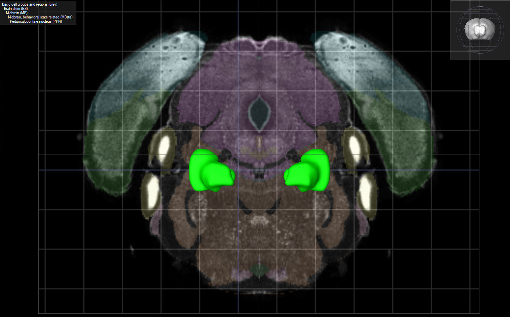 | 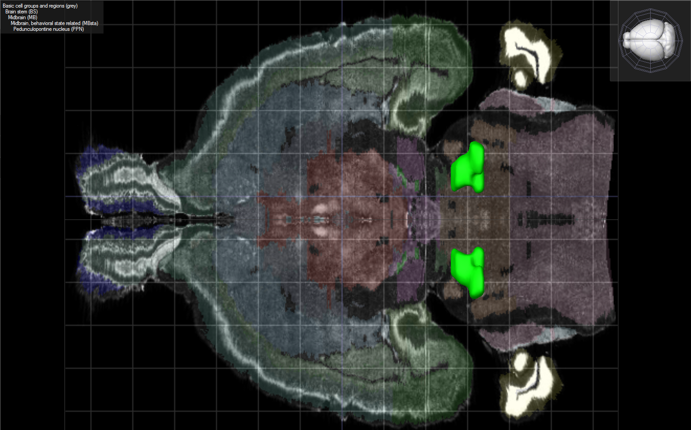

**Description**  
The pedunculopontine tegmental nucleus (PPTg) and laterodorsal tegmental nucleus (LDTg) provide cholinergic afferents to several brain areas. This cholinergic complex has been suggested to play a role in sleep, waking, motor function, learning and reward.  (http://www.ncbi.nlm.nih.gov/pmc/articles/PMC3833361/)

The pedunculopontine nucleus (PPN) (or pedunculopontine tegmental nucleus, PPTN or PPTg) is located in the brainstem, caudal to the substantia nigra and adjacent to the superior cerebellar peduncle. It has two divisions, one containing cholinergic neurons, the pars compacta, and one containing mostly glutamatergic neurons, the pars dissipata. The PPN is one of the main components of the reticular activating system. 

(Garcia-Rill E. (1991). The pedunculopontine nucleus. Prog Neurobiol. 36(5):363-89. PMID 1887068)  
(Winn P. (2006). How best to consider the structure and function of the pedunculopontine tegmental nucleus: evidence from animal studies. J Neurol Sci. 25;248(1-2):234-50. PMID 16765383)

**Projections**  
PPN neurons project axons to a wide range of areas in the brain,[5] particularly parts of the basal ganglia such as the subthalamic nucleus, substantia nigra pars compacta, and globus pallidus internus. It also sends them to targets in the thalamus, cerebellum, basal forebrain, and lower brainstem, and in the cerebral cortex, the supplementary motor area and somatosensory and motor cortices.[1],[2],[6]

It receives inputs from many areas of the brain,[7] including the basal ganglia to which it projects with the exception of the substantia nigra pars compacta to which it projects but does not receive, while it receives but does not project to the substantia nigra pars reticulata.[1],[2]

**Functions**  
The PPN is involved in many functions, including arousal, attention, learning, reward, and voluntary limb movements and locomotion.[8],[9] While once thought important to the initiation of movement, recent research suggests a role in providing sensory feedback to the cerebral cortex.[8] It is also implicated in the generation and maintenance of REM sleep.[10]

Recent research has discovered that the PPN is involved in the planning of movement, and that different networks of neurons in the PPN are switched on during real and imagined movement.[9]

### Amygdala

Full table of neuron number

Part									|Neuron number   	| Link
----------------------------------------|-------------------|-----
**Motor cortex**						|					| [[1](#motor-cortex)]
motor cortex[Glu0]						|29000000 * 0.8 /6	| 
motor cortex[Glu1]						|29000000 * 0.2 /6	| 
**Striatum**							|					| [[2](#striatum)]
striatum[D1]							|2500000 * 0.425	| 
striatum[D2]							|2500000 * 0.425	| 
striatum[tan]							|2500000 * 0.05		| 
**Globus pallidus**						|					| [[3](#globus-pallidus)]
gpe[GABA]								|84100				| 
gpi[GABA]								|12600				|
**Subthalamic nucleus**					|					| [[4](#subthalamic-nucleus)]
stn[Glu]								|22700				
**Substancia nigra**					|					| [[5](#substancia-nigra)]
snc[GABA]								|3000
snc[DA]									|12700
snr[GABA]								|47200
**Thalamus**							|					| [[5](#thalamus)]
thalamus[Glu]							|5000000 / 6
**Prefrontal cortex**					|					| [[6](#prefrontal-cortex)]
prefrontal cortex[Glu0]					|183000
prefrontal cortex[Glu1]					|183000
**Nucleus Accumbens**					|					| [[7](#nucleus-accumbens)]
nac[ACh]								|1500
nac[GABA0]								|14250
nac[GABA1]								|14250
**Ventral tegemntal area**				|					|[[8](#vta)]
vta[GABA0]								|7000
vta[DA0]								|20000
vta[GABA1]								|7000
vta[DA1]								|20000
vta[GABA2]								|7000
**Pedunculopontine tegmental nucleus**	|					|[[9](#pptg)]
tpp[GABA]								|2000
tpp[ACh]								|1400
tpp[Glu]								|2300
**Amygdala**							|					|[[10](#amygdala)]
amygdala[Glu]							|30000

## Reference

1. [Janhunen, S. & Ahtee, L.: Differential nicotinic regulation of the nigrostriatal and mesolimbic dopaminergic pathways: implications for drug development. Neuroscience & Biobehavioral Reviews (Impact Factor: 8.8). 02/2007; 31(3):287-314.][Janhunen2006]  
	DOI: 10.1016/j.neubiorev.2006.09.008
2. [van Dongen, Yvette Charlotte: Direct and indirect communication between functionally different regions of the rat striatum (2007)][Dongen2007]  
	DOI: -
3. [Jennifer H. Hsieh, Dan J. Stein  and Fleur M. Howells: The neurobiology of methamphetamine induced psychosis. Frontiers in Human Neuroscience (Impact Factor: 3.63). 07/2014; 8:537. ][Jennifer2014]  
	DOI: 10.3389/fnhum.2014.00537
4. 4
